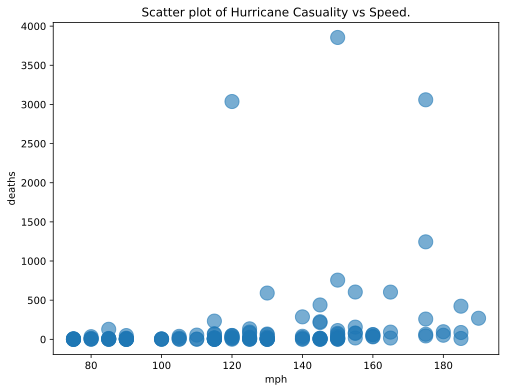
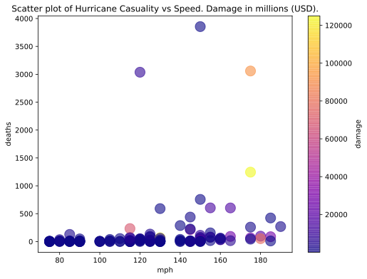
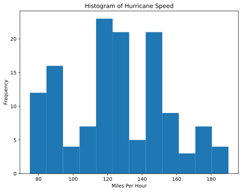

# Project 4: Building a Data Website

## Corrections / Clarifications

* added [P4 Tips and Tricks](https://mediaspace.wisc.edu/media/CS%20320%20-%20P4%20Tips%20and%20Tricks/1_wvd58pcp)
* removed robots.txt component

## Handin

When you're done, you'll hand in a .zip file containing `main.py`,
`main.csv`, and any `.html` files necessary (basically whatever we need 
to run your website).

You can create a zip file from the terminal.  Let's say you're already in 
a directory named `p4`.  You can run this to create a compressed p4.zip
file alongside your directory:

```
zip ../p4.zip main.py main.csv *.html
```

**Important:** make sure your program is named `main.py` (we've been
more flexible about this in the past, but naming it something else
causes problems for us now that it's in a zip).

## Overview

In this project, you'll build a website for sharing a dataset -- you
get to pick the dataset (more on possible sources for data later).

You'll use the flask framework for the site, which will have the
following features: (1) multiple plots on the home page, (2) a page
for browsing through the table behind the plots, (3) a link to a
donation page that is optimized via A/B testing, and (4) a subscribe
button that only accepts valid email addresse.

Your `.py` file may be short, perhaps <100 lines, but it will probably
take a fair bit of time to get those lines right.

Consider watching this [P4 Tips and Tricks](https://mediaspace.wisc.edu/media/CS%20320%20-%20P4%20Tips%20and%20Tricks/1_wvd58pcp) video, which Garrison kindly volunteered to record.

## Setup

First, install some things:

```
pip3 install Flask lxml html5lib beautifulsoup4
```

# Group Part (75%)

## Data

You get to choose the dataset for this project.  Find a CSV you like
somewhere, then download it as a file named `main.csv`.

The file should have between 10 and 1000 rows and between 3 and 15
columns.  Feel free to drop rows/columns from your original data
source if necessary.

**Mandatory**: leave a comment in your `main.py` about the source of
your data.

If you're looking for dataset ideas, here are a few places to look:
 - https://data-cityofmadison.opendata.arcgis.com
 - https://data.dhsgis.wi.gov/
 - https://www.kaggle.com/datasets
 - https://datasetsearch.research.google.com

## Pages

Your web application should have three pages:
* index.html
* browse.html
* donate.html

We have some requirements about what is on these, but you have quite a
bit of creative freedom for this project.

To get started, consider creating a minimal `index.html` file:

```html
<html>
  <body>
    <h1>Welcome!</h1>

    <p>Enjoy the data.</p>
  </body>
</html>
```

Then create a simple flask app in `main.py` with a route for the
homepage that loads `index.html`:

```python
import pandas as pd
from flask import Flask, request, jsonify

app = Flask(__name__)
# df = pd.read_csv("main.csv")

@app.route('/')
def home():
    with open("index.html") as f:
        html = f.read()

    return html

if __name__ == '__main__':
    app.run(host="0.0.0.0", debug=True, threaded=False) # don't change this line!

# NOTE: app.run never returns (it runs for ever, unless you kill the process)
# Thus, don't define any functions after the app.run call, because it will
# never get that far.
```

Try launching your application by running `python3 main.py`:
```
trh@instance-1:~/p4$ python3 main.py
 * Serving Flask app "main" (lazy loading)
 * Environment: production
   WARNING: This is a development server. Do not use it in a production deployment.
   Use a production WSGI server instead.
 * Debug mode: off
 * Running on http://0.0.0.0:5000/ (Press CTRL+C to quit)
```

This program runs indefinitely, until you kill it with `CTRL+C`
(meaning press `CTRL` and `C` at the same time).  Open your web
browser and go to `http://your-ip:5000` to see your page ("your-ip" is
the IP you use to SSH to your VM).

Requirements:

* Going to `http://your-ip:port/browse.html` should return the content for `browse.html`, and similarly for the other pages.
* The index.html page should have hyperlinks to all the other pages.  Be sure to not include your IP here! A relative path is necessary to pass our tests.
* You should put whatever content you think makes sense on the pages.  Just make sure that they all start with an `<h1>` heading, giving the page a title.

## Browse

The `browse.html` page should show an HTML table with all the data
from `main.csv`.  Don't truncate the table on the page; we want to see
all the rows from main.csv on the screen (it is OK to delete rows in
main.csv if you want a shorter file).  Don't have any other tables on
this page, so as not to confuse our tester.

The page might look something like this:


**Hint 1:** you don't necessarily need to have an actual `browse.html`
file just because there's a `browse.html` page.  For example, here's a
`hi.html` page without a corresponding `hi.html` file:

```python
@app.route('/hi.html')
def hi_handler():
    return "howdy!"
```

For browse, instead of returning a hardcoded string, you'll need to
generate a string containing HTML code for the table, then return that
string. For example, `"<html>{}<html>".format("hello")` would insert `"hello"`
into the middle of a string containing HTML code. 

**Hint 2:** look into `_repr_html_` for DataFrames (or possibly `to_html()`).

## Emails

There should be a button on your site that allows people to share
their email with you to get updates about changes to the data:


When the button is clicked, some JavaScript code will run that does the following:
1. pops up a box asking the user for their email
2. sends the email to your flask application
3. depending on how your flask application responds, the JavaScript will either tell the user "thanks" or show an error message of your choosing

We'll give you the HTML+JavaScript parts, since we haven't taught that in class.

Add the following `<head>` code to your `index.html`, before the `<body>` code:

```html
  <head>
    <script src="https://code.jquery.com/jquery-3.4.1.js"></script>
    <script>
      function subscribe() {
        var email = prompt("What is your email?", "????");

        $.post({
          type: "POST",
          url: "email",
          data: email,
          contentType: "application/text; charset=utf-8",
          dataType: "json"
        }).done(function(data) {
          alert(data);
        }).fail(function(data) {
          alert("POST failed");
        });
      }
    </script>
  </head>
```

Then, in the main body of the HTML, add this code for the button somewhere:

```html
<button onclick="subscribe()">Subscribe</button>
```

Whenever the user clicks that button and submits an email, it will
POST the data to the `/email` route in your app, so add that to your
`main.py`:

```python
@app.route('/email', methods=["POST"])
def email():
    email = str(request.data, "utf-8")
    if re.match(r"????", email): # 1
        with open("emails.txt", "a") as f: # open file in append mode
            f.????(email + ????) # 2
        return jsonify(f"thanks, you're subscriber number {num_subscribed}!")
    return jsonify(????) # 3
```

Fill in the `????` parts in the above code so that it:
1. use a regex that determines if the email is valid
2. writes each valid email address on its own line in `emails.txt`
3. sternly warns the user if they entered an invalid email address to stop being so careless (you choose the wording)

Also find a way to fill the variable `num_subscribed` with the number
of users that have subscribed so far, including the user that just got
added.

**Note:** you can find information about `jsonify`
[here](https://flask.palletsprojects.com/en/2.0.x/api/#flask.json.jsonify).

## Donations

On your donations page, write some text, making your best plea for
funding.  Then, let's find the best design for the homepage, so that
people are most likely to click the link to the donations page.

We'll do an A/B test.  Create two version of the homepage, A and B.
They should differ in some way, perhaps trivial (e.g., maybe the link
to donations is blue in version A and red in version B).

The first 10 times your homepage is visited, alternate between version
A and B each time.  After that, pick the best version (the one where
people click to donate most often), and keep showing it for all future
visits to the page.

**Hint 1:** consider having a global counter in `main.py` to keep track of
how many times the home page has been visited.  Consider whether this
number is 10 or less and whether it is even/odd when deciding between
showing version A or B.

**Hint 2:** when somebody visits `donate.html`, we need to know if
  they took a link from version A or B of the homepage.  The easiest
  way is with query strings.  On version A of the homepage, instead of
  having a regular link to "donate.html", link to
  "donate.html?from=A", and in the link on version B to donate.html,
  use "donate.html?from=B".  Then the handler for the "donate.html"
  route can keep count of how much people are using the links on both
  versions of the home page.
  
**Hint 3:** You don't necessarily need to have two different versions
of your homepage to make this work. You could use the templating
approach: once you read your index.html file into your program, you
can edit it. At that point it should be a string, so you could add
something to it or replace something in it.

# Individual Part (25%)

## Rate Limiting JSON Page

JSON files are used to transmit structured data over network
connection.  Add a resource at `https://your-ip:port/browse.json` that
displays the same information as `browse.html`, but in JSON format
(represent the DataFrame as a list of dicts, such that each dict
corresponds to one row).

Check the client IP with `request.remote_addr`.  Do not allow more
than one request per minute from any one IP address.

**Hint 1:** consider combining Flask's `jsonify` with Pandas `to_dict`: https://pandas.pydata.org/docs/reference/api/pandas.DataFrame.to_dict.html

**Hint 2:** we cover rate limiting at the end of March 9th lecture.  

## Dashboard

Implement a dashboard on your homepage showing at least 3 SVG images.
The SVG images must correspond to at least 2 different flask routes,
i.e., one route must be used at least twice with different query
strings (resulting in different plots).

### Requirements

* All plots are based on the data chosen for `browse.html`, but you are free to choose what is plotted. 
Plots should have labels for both axes and optionally a title.
* Similarly, there is no restriction on the choice of query string parameters, 
except that the resulting plots should be distinct.

E.g., We could have a dashboard with the following lines added to the
`index.html` file (you're encouraged to use more descriptive names for
your .svg routes).

```html
<br><br>
<br><br>
<br><br>
```

The dashboard SVGs may look something like this:

#### dashboard_1.svg


#### dashboard_1.svg?cmap=damage

Here, the query string uses `cmap`, which specifies an additional third column to use for a colormap.



#### dashboard_2.svg



When using query strings, ensure appropriate default values are supplied.

### Important

* Ensure you are using the "Agg" backend for matplotlib, by explicitly setting
    
    ```python
    matplotlib.use('Agg')
    ```

    right after importing matplotlib.

* Ensure that `app.run` is launched with `threaded=False`.
    
* Further, use `fig, ax = plt.subplots()` to create the plots and close the plots after `savefig` with `plt.close(fig)` (otherwise you may run out of memory).

## Concluding Thoughts

Get started early, test often, and, above all, have fun with this one!
